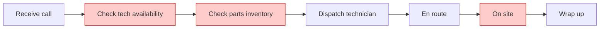

# VIBE Current-State Journey

Produce `engagement/{{engagement-kebab}}/current-state-journey.md` — one of the three required Discover deliverables. Maps how the primary persona accomplishes the task today: stages, steps, other stakeholders, systems/data touched, and the pain at each step.

This is the document the **Disrupt workshop transforms** into a future-state journey. Without it, the workshop has nothing concrete to redesign.

## Inputs

- ${input:engagement}: (Optional) Engagement name. Auto-detected if only one engagement exists under `engagement/`.

## Requirements

### Step 1 — Read all sources

- `engagement/{{engagement-kebab}}/PROJECT-CONTEXT.md` (Section 5 Data Available — system inventory; Section 6 Stakeholders)
- `engagement/{{engagement-kebab}}/personas.md` (the primary persona is the journey's protagonist)
- `engagement/{{engagement-kebab}}/problem-statement.md` (the "Because..." line names the systemic blockers)
- Every transcript in `sources/` (look for descriptions of "how it works today", "first I do X, then Y", screen-share narrations)
- `sources/questionnaire-responses.md` (process-walkthrough questions)
- `sources/research/research-summary.md` (industry benchmark journeys)
- Any prior `engagement/{{engagement-kebab}}/current-state-journey.md`

### Step 2 — Identify the persona and the task

This journey maps **one persona** doing **one task** — always the primary persona from `personas.md`. If a secondary persona has a meaningfully different journey, capture it as a separate stages table inside the same file under a `## Secondary persona journey` heading. The canonical filename is always `current-state-journey.md` — the state.json schema, doctor checks, Define inputs, and Discover gate all expect that single file.

The task is the JTBD from the persona file. For a Contoso dispatcher persona, it's "respond to an emergency call and dispatch the right technician". For a clinician persona, it's "review a patient's chart and decide next action". One task per file.

### Step 3 — Extract stages from sources

Walk the sources end-to-end of the task and identify natural breakpoints. A typical journey has **5-7 stages**. If you can find fewer than 3 stages with source backing, stop — you don't have enough source material yet. Flag this and recommend gathering more (process walkthrough in a discover working session).

For each stage, capture:

- **Stage name** — short, action-oriented ("Receive call", not "Phase 1")
- **Steps the persona takes** — concrete actions, in order. 2-5 bullets per stage.
- **Other stakeholders involved** — named roles (technician, supervisor, customer). Use `_(none)_` if the persona acts alone at this stage.
- **Systems / data touched** — named systems and data files (dispatch tool, SAP, Excel inventory, phone). Use `_(none)_` if no system is involved.
- **Challenges / pains** — what makes this stage hard. Direct quotes from sources where possible.

Source-cite every stage. If a stage is inferred (no direct source), mark it `[inferred — needs validation]` and the grade drops to C.

### Step 4 — Generate the Mermaid diagram

Copy `templates/current-state-journey.md` to `engagement/{{engagement-kebab}}/current-state-journey.md`, then auto-generate the Mermaid `flowchart LR` block:



Rules:

- Use the actual stage names from Step 3, not "Stage1"
- Mark any stage with a pain in red using the `painPoint` class
- If the journey has branching (e.g. "if part in stock → dispatch; if not → escalate"), use Mermaid's branching syntax (`-->|Yes|` / `-->|No|`)
- If the journey has >10 stages OR complex parallel paths, skip the diagram and write: `> _Mermaid diagram skipped — see stages table below; consider a Miro board for visualization._`

### Step 5 — Fill the stages table

Fill the structured Markdown table with one row per stage. Empty cells use `_(none)_` to distinguish "no involvement" from "no data".

### Step 6 — Surface the top pain points

The "Top pain points (ranked)" section at the bottom lists the 3 highest-impact pains. These feed directly into the Disrupt workshop's ideation prompts. Rank by:

1. **Frequency** — happens every job vs occasional edge case
2. **Impact** — quantified $/time/quality cost (use figures from problem-statement.md where possible)
3. **Persona blocker** — does it prevent the persona from achieving the JTBD?

### Step 7 — Grade the document

| Grade | Criteria |
|---|---|
| **A** | ≥5 stages, every stage has steps + stakeholders + systems/data + pains, Mermaid renders, every stage sourced |
| **B** | ≥3 stages with stakeholders/systems/pains identified per stage, sourced |
| **C** | <3 stages, OR stages missing stakeholders/systems/pains, OR unsourced/inferred stages |

### Step 8 — Update state.json

Update `state.json.readiness.discover.currentStateJourney`:

```json
{
  "status": "filled" | "partial" | "empty",
  "grade": "A" | "B" | "C",
  "path": "engagement/{{engagement-kebab}}/current-state-journey.md",
  "stageCount": <number>,
  "signedOffBy": null | "<reviewer name>",
  "lastUpdated": "<ISO timestamp>"
}
```

### Step 9 — Present and direct

End with one of:

- If Grade A and all 3 deliverables (personas + problem-statement + current-state-journey) are Grade B+: `👉 NEXT: All 3 Discover deliverables are ready. Click "🎬 Begin Disrupt Workshop" to start the Week 2 workshop sequence. (Send all 3 deliverables to {{sponsor}} for sign-off first — they're the inputs the customer reacts to in the room. Legacy alternative: click "💡 Move to Define (legacy)" to take the old Define → Ideate path.)`
- If Grade A but other deliverables are below B: `👉 NEXT: Current journey is solid. Click "{button for the gap}" to address the next gap before moving to Disrupt.`
- If Grade B: `👉 NEXT: To lift to Grade A, add 2 more stages OR enrich every stage with all 4 columns (steps, stakeholders, systems, pains). A process walkthrough at the next discover working session is the fastest way.`
- If Grade C: `👉 NEXT: Only {N} stages identified with source backing. Schedule a 30-min process walkthrough with {{primary-persona-role}} and re-run /vibe-current-journey. Discover cannot close until this is Grade B+.`

## Notes

- Re-running is safe — signed-off journey (Sign-off row filled) is preserved; new sources can add stages or refine details but won't overwrite the signed version.
- If `personas.md` doesn't exist yet, this prompt fails fast with: `👉 NEXT: Run /vibe-personas first — the journey is anchored to the primary persona.`
- This prompt does NOT modify `PROJECT-CONTEXT.md` Section 5. The agent updates a new Section 8.5 with a 1-line summary + link to this canonical file.
