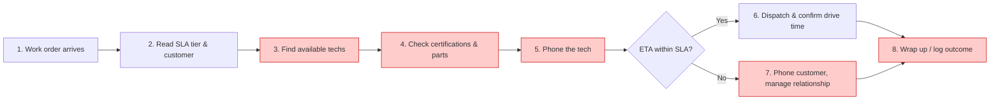

# Current-State User Journey

> **Discover deliverable.** Auto-generated by `/vibe-current-journey` from `engagement/contoso-dispatcher-ai/PROJECT-CONTEXT.md` Section 5, `engagement/contoso-dispatcher-ai/personas.md`, and `sources/transcript-kickoff.md`. Reviewed by Bartosz Nowak (Senior Dispatcher) on 2025-02-14.

---

## Grading

**Grade A** — 8 stages, every stage has steps + stakeholders + systems/data + pains, Mermaid renders, every stage sourced to the kickoff transcript or customer brief.

---

## Key persona

This journey follows **Bartosz Nowak** (Senior Dispatcher, Warsaw centre). See [`personas.md`](./personas.md) for full persona detail.

The task: respond to a Platinum-tier emergency HVAC call (2-hour SLA window) end-to-end from work order receipt to either successful dispatch or a logged/un-logged breach.

---

## Visual journey

---

## Stages table

| # | Stage | Steps Bartosz takes | Other stakeholders involved | Systems / data touched | Challenges / pains |
|---|---|---|---|---|---|
| 1 | Work order arrives | Sees new ticket pop into the queue; reads opening summary; mentally classifies (emergency vs scheduled) | _(none — Bartosz alone)_ | Dispatch tool (2008 ASP.NET) | On Tuesday mornings ~50 land in a tight window — context-switch tax is high |
| 2 | Read SLA tier & customer | Identifies Platinum (2hr) vs Gold (4hr); checks customer name and breach history mentally | _(none)_ | Dispatch tool; soft knowledge of customer history | No visual prioritisation of Platinum tickets in the queue — easy to miss in the rush |
| 3 | Find available techs | Looks at map for nearby techs; tries to recall who's wrapping which previous job | Field technicians (e.g. Marek Sokoł) | Dispatch tool (location only); alt-tab to Google Maps for drive time | Tool shows "available" the moment a tech closes a ticket, even if they're 30 min from the next location — assumption is wrong half the time |
| 4 | Check certifications & parts | Cross-references tech certifications (e.g. refrigerant, F-Gas); checks parts inventory for the site | _(none)_ | F-Gas compliance spreadsheet (weekly sync); parts inventory in SAP (nightly sync); tech skills matrix in HR system | Four systems, three sync cadences, none integrated — Bartosz mentally merges them; nightly parts data is often wrong by morning |
| 5 | Phone the tech | Calls the candidate tech; asks "can you take a Platinum at <site> in <X> minutes?"; gets ETA back | Field technician | Phone (no system capture); _(no ETA flows into dispatch tool)_ | Tech might say "give me 40 minutes" pushing into breach territory; Bartosz now does SLA math by hand |
| 6 | Dispatch & confirm drive time | Assigns work order to tech; sends drive-time estimate via Teams chat | Field technician | Dispatch tool (assignment); Google Maps; Teams | Manual handoff; if Bartosz forgets the drive time tech might leave late |
| 7 | Phone customer (only if at risk) | Calls customer to warn of slip; offers credit (typically 10% on next invoice); negotiates acceptance | Customer; Anya Petrov (Customer Service Lead — sometimes loops her in) | Phone; CRM (not always updated) | If warning is 15+ minutes late, customer is already angry — relationship credit gone. Soft credits often not logged → no breach signal for renewal review |
| 8 | Wrap up / log outcome | Closes the work order; logs formal breach (only if hard breach); does NOT log informal credits | Customer Service Lead (if escalated) | Dispatch tool; breach log (formal only) | Roughly 3/4 of soft breaches go un-logged — Anya's team flies blind into the next call from the same customer |

---

## Source evidence

| Stage | Source file | Line / quote |
|---|---|---|
| 1 | `sources/transcript-kickoff.md` | line 30 ("Tuesdays are the worst because we're catching up from weekend emergencies"); customer-brief.md (180 work orders/day across 14 dispatchers) |
| 2 | `sources/customer-brief.md` | systems landscape section (Platinum 2hr / Gold 4hr) |
| 3 | `sources/transcript-kickoff.md` | line 30 ("certified refrigerant techs in driving range … One was finishing another job, ETA unknown") and line 88 ("Don't make me alt-tab to Google Maps") |
| 4 | `sources/transcript-kickoff.md` | lines 30 ("Second was certified but a junior — never worked alone on that model") and 71-72 (F-Gas compliance data in spreadsheet, weekly sync) |
| 5 | `sources/transcript-kickoff.md` | line 34 ("Phoned the senior tech, he said 'give me 40 minutes'") |
| 6 | `sources/transcript-kickoff.md` | line 88 (Google Maps alt-tab); workshop-1 (drive-time visualisation captured as feature ask) |
| 7 | `sources/transcript-kickoff.md` | lines 34, 46 ("phoned the customer, warned them, offered a 10% credit … customers don't mind being told something's slipping if you tell them in time") |
| 8 | `sources/transcript-kickoff.md` | lines 38, 42 ("We breach maybe a quarter of those formally. The rest, we eat the cost informally … real number is higher. Maybe €5-6M") |

---

## Top pain points (ranked)

These feed directly into the Disrupt workshop's ideation prompts. Ranking blends frequency, financial impact, and persona-blocker severity.

1. **No SLA-risk early warning** — happens at stage 5/7, affects Bartosz + Anya + the customer, costs an estimated €1-2M/year in lost relationship credit alone (Sandra: *"Customers don't mind being told something's slipping if you tell them in time"*). This is the **highest-ROI first deliverable**.
2. **Four systems, three sync cadences, no integration** — happens at stages 3-4, affects every dispatch decision, contributes structurally to the €4M penalty figure. Hardest to fix but biggest prize.
3. **Informal/soft breaches go un-logged** — happens at stage 8, affects Anya's team and renewal conversations, contributes to the gap between Sandra's "€4M on books" and "€5-6M real" numbers. Easy quick-win on logging UX.

---

## Sign-off

| Reviewed by | Role | Date | Signature / approval note |
|---|---|---|---|
| Bartosz Nowak | Senior Dispatcher | 2025-02-14 | Approved — "This is my Tuesday" |
| Sandra Holtz | COO | 2025-02-14 | Approved — "Pain ranking matches my own gut" |
