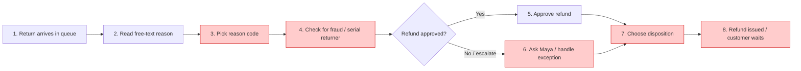

# Current-State User Journey

> **Discover deliverable.** Auto-generated by `/vibe-current-journey` from `engagement/tailwind-returns-ai/PROJECT-CONTEXT.md` Section 5, `engagement/tailwind-returns-ai/personas.md`, and `sources/transcript-kickoff.md`. Reviewed by Maya Okafor (Returns Team Lead) on 2026-06-26.

---

## Grading

**Grade A** — 8 stages, every stage has steps + stakeholders + systems/data + pains, Mermaid renders, every stage sourced to the discovery transcript, customer brief, voice-of-customer extracts, or anonymised CSV exports.

---

## Key persona

This journey follows **Callum Reyes** (Returns Agent, Bristol contact centre). See [`personas.md`](./personas.md) for full persona detail.

The task: process an online return end-to-end from the moment a return arrives in the ReturnDesk queue to the point the refund is issued and the item is routed to restock, refurbish, liquidate, or recycle.

---

## Visual journey

---

## Stages table

| # | Stage | Steps Callum takes | Other stakeholders involved | Systems / data touched | Challenges / pains |
|---|---|---|---|---|---|
| 1 | Return arrives in queue | Sees a new row in ReturnDesk after the warehouse scans the physical return; opens the order and item summary | Warehouse / reverse logistics team (Dev Patel's area) | ReturnDesk; scanned return; order number; SKU/product name | Emotion: alert but already under queue pressure. AI could help by summarising the case; it would get in the way if it delayed opening the row. |
| 2 | Read free-text reason | Reads the customer's own words, which may be a one-word note ("too small") or a detailed safety complaint | Customer (indirectly through the return note) | ReturnDesk free-text reason; product row | Emotion: empathetic but time-boxed. AI could help by extracting intent and urgency, especially for R-50021 ("Gas leak on first use, extremely dangerous"); it must not flatten a safety case into a routine label. |
| 3 | Pick reason code | Maps the note to the reason dropdown; if options overlap or the queue is heavy, picks "Other" / leaves the code blank and moves on | Maya Okafor if the agent asks for help; buying/product teams downstream | ReturnDesk reason-code dropdown; reason-code taxonomy; `returns.csv` reason_code | 41% of returns are coded "Other" in the business; in the sample, 14 of 42 rows have blank reason_code despite rich text (e.g. R-50014, R-50031, R-50050). Emotion: frustration. AI could help by suggesting a code with confidence; it would get in the way if it gave a magic answer with no explanation or no edit path. |
| 4 | Check for fraud / serial returner | Tries to spot whether the return pattern looks abusive: repeated category, same item, worn condition, suspicious reason; may dig through customer history manually | Maya Okafor; Raj Singh / finance; customer if challenged | Separate order-history screen; `customers.csv`; prior returns in `returns.csv` | No useful history visibility in the workflow. C-1007 has 14 orders / 11 returns (79%) and worn boot rows R-50014, R-50020, R-50037, but Callum has no structured flag. Emotion: anxious and exposed. AI could help by showing evidence; it would get in the way if it accused legitimate comparers like R-50031/R-50032 of fraud. |
| 5 | Approve / deny refund | Confirms most refunds; considers denial/escalation only when abuse, safety, or policy risk is visible | Customer; Maya for judgement calls; Raj for refund-policy guardrails | ReturnDesk refund decision; SAP downstream refund process | Finance requires human approval. Emotion: responsible. AI could help by highlighting relevant policy and risk; it must not auto-refund or auto-deny. |
| 6 | Ask Maya / handle exception | Messages Maya or digs longer when the case is high-value, vague, suspicious, or emotionally sensitive | Maya Okafor; sometimes customer care; sometimes finance | Teams; order history; ReturnDesk notes | Messy cases can take 15-20 minutes; Callum reported spending 20 minutes on one return. Emotion: blocked and conscious of the queue. AI could help by gathering evidence into one view; it would get in the way if every low-risk case became an escalation. |
| 7 | Choose disposition | Picks restock, refurbish, liquidate, or recycle from the desk based on reason, product, value, and reported condition | Warehouse / reverse logistics; Dev Patel; next customer if the item is wrongly restocked | ReturnDesk disposition field; product/category/value; condition_reported in `returns.csv` | The agent cannot see the item; roughly 30% of dispositions are sub-optimal. Examples: new tents R-50031/R-50032 can be restocked; worn C-1007 boots go liquidate/recycle; R-50021 safety stove should recycle/escalate. Emotion: guessing. AI could help explain product + condition logic; it would get in the way if it ignored warehouse safety rules. |
| 8 | Refund issued / customer waits | Submits the decision; the refund then moves through the downstream queue and the customer waits for money and updates | Customer; SAP/finance operations; Elena's CX team | ReturnDesk status; SAP refund; customer notifications / absence of updates | Average refund cycle is 9 days, target under 3; VOC includes customers waiting over a week and at Christmas up to 16 days. Emotion: relief for agent, silence/frustration for customer. AI could help reduce rework and improve update quality; it would get in the way if it hid the human decision trail. |

---

## Source evidence

| Stage | Source file | Line / quote |
|---|---|---|
| 1 | `sources/transcript-kickoff.md` | cue 4 (warehouse scans the item and it pops into ReturnDesk as a row in the queue); `sources/customer-brief.md` line 17 (22 agents on ReturnDesk) |
| 2 | `sources/transcript-kickoff.md`; `sample-data/returns.csv` | cue 6 (customer notes range from one word to essays); R-50021 reason_text "Gas leak on first use, extremely dangerous, please investigate" |
| 3 | `sources/transcript-kickoff.md`; `sample-data/returns.csv`; `sources/voice-of-customer.txt` | cues 6-8 (forty-something overlapping options, 41% last quarter); 14 blank reason_code rows in returns.csv; Priya lines 65-67 ("Just putting Other again sorry") |
| 4 | `sources/transcript-kickoff.md`; `sample-data/customers.csv`; `sample-data/returns.csv`; `sources/voice-of-customer.txt` | cues 11-14 (no system, £2.3M leakage); customers C-1007/C-1013/C-1019 flagged yes; C-1007 rows R-50014/R-50020/R-50037/R-50050; Callum lines 69-71 |
| 5 | `sources/customer-brief.md`; `sources/transcript-kickoff.md` | customer brief lines 27 and 56 (assistant only, human approves); cue 30 (agent confirms, edits, or overrides) |
| 6 | `sources/transcript-kickoff.md`; `sources/voice-of-customer.txt` | cue 22 (messy return can be 15 minutes, separate screen, messaging Maya); Callum lines 80-82 (20 minutes on one return) |
| 7 | `sources/transcript-kickoff.md`; `sample-data/returns.csv`; `sources/voice-of-customer.txt` | cues 16-18 (four dispositions, 30% sub-optimal); Nadia lines 76-78 ("I just pick restock"); examples R-50021, R-50031, R-50032, R-50037 |
| 8 | `sources/customer-brief.md`; `sources/transcript-kickoff.md`; `sources/voice-of-customer.txt`; `sample-data/returns.csv` | customer brief lines 21, 37; transcript cues 22, 24, 26; VOC lines 15-21, 35-37, 51-56; days_to_refund examples R-50018 (19), R-50020 (21), R-50034 (20), R-50046 (19), R-50050 (19) |

---

## Top pain points (ranked)

These feed directly into the Disrupt workshop's ideation prompts. Ranking blends frequency, financial impact, customer impact, and persona-blocker severity.

1. **Reason coding collapses under pressure** — happens at stage 3, affects agents + Maya + buying/product + Elena, and hides the signal from 41% of returns. This is the **highest-confidence first deliverable** because it helps every agent immediately, is lower risk than fraud-first, and unlocks reliable analytics.
2. **Serial-returner detection is manual, unfairly risky, and financially material** — happens at stage 4/6, affects Callum + Maya + Raj + customers, and contributes to the £2.3M/year leakage estimate. The prize is big, but the assistant must distinguish C-1007-style worn boot patterns from legitimate comparison buying like R-50031/R-50032.
3. **Disposition is a desk-based guess with warehouse consequences** — happens at stage 7, affects Dev's reverse-logistics team, margin recovery, and the next customer experience. Roughly 30% of items go to the wrong place; a good assistant can explain why restock/refurbish/liquidate/recycle fits, but safety cases such as R-50021 must stay human-visible.

---

## Sign-off

| Reviewed by | Role | Date | Signature / approval note |
|---|---|---|---|
| Maya Okafor | Returns Team Lead, Bristol | 2026-06-26 | Approved — "This is the job, especially the bit where the system makes us guess" |
| Elena Marsh | Director, Digital Customer Experience | 2026-06-26 | Approved — "Pain ranking matches the sequencing we need for the workshop" |
