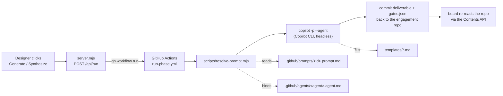

# VIBE Web Surface — Architecture

The web surface is a **thin remote control over the VIBE harness**. It contains no
copy of the engagement logic: it doesn't know how to write a persona, grade a
deliverable, or synthesize context. Every document it produces is generated by the
*same* agents, prompts, and templates a VS Code user drives — invoked through the
real Copilot CLI engine running headless in GitHub Actions.

This document explains how that works and where each responsibility lives.

## Who it's for

Phases 1–3 (Preparation → Discover → Disrupt) are **designer/PM owned and
non-technical**. The surface gives those users a browser UI to:

- create an engagement (a private GitHub repo from the VIBE template),
- drop customer **sources** into a bucket (transcripts, briefs, Office/PDF docs, pasted notes),
- **synthesize** and **generate** the Discover deliverables from those sources,
- **review** every source and deliverable in-app, with provenance, and
- **approve** (sign off) a deliverable.

Phases 4–5 (Build → Deliver) are engineer-owned and happen in VS Code / the repo —
the surface intentionally does not surface those.

## Three principles

1. **The harness is the engine; the surface is a remote.** The web app never
   reimplements a prompt. It dispatches the existing `.github/prompts/*` +
   `.github/agents/*` + `templates/*` via a workflow. (See the dispatch chain below.)
2. **Git is the source of truth.** The surface stores only a local pointer file
   (`surface/.engagements.json`, gitignored) mapping engagement → repo. Everything
   *about* an engagement — sources, deliverables, the gate ledger — lives in that
   engagement's own repo. An engineer opening the repo in VS Code sees exactly what
   the designer sees in the browser.
3. **Runs as you.** Auth piggybacks on the GitHub CLI (`gh auth token`). Every
   action — repo creation, workflow dispatch, commits — happens under your own
   GitHub identity and Copilot seat. No service account, no separate OAuth app.

## The dispatch chain (how a document gets made)

When a designer clicks **Generate** (or **Synthesize context**), this happens:



Step by step:

1. **`server.mjs` → `runPhase()`** maps the requested file to a prompt id via
   `FILE_PROMPT`, then shells `gh workflow run run-phase.yml -f prompt=<id> -f
   engagement=<kebab> -f seed_demo=<bool>` **against the engagement's own repo**.
2. **`run-phase.yml`** checks out the engagement repo, installs the Copilot CLI, and
   runs `scripts/resolve-prompt.mjs <prompt>`.
3. **`resolve-prompt.mjs`** loads `.github/prompts/<id>.prompt.md`, resolves the
   `agent:` named in its frontmatter to the matching `.github/agents/*.agent.md`,
   substitutes `{{engagement-kebab}}` / `${input:…}`, and writes
   `.vibe/agent.txt` + `.vibe/invocation.md` (a headless, autonomous task prompt).
4. **The engine step** runs `copilot -p "$(cat .vibe/invocation.md)" --agent "$(cat
   .vibe/agent.txt)" --allow-all --no-ask-user`. The prompt body copies and fills
   `templates/*.md` into `engagement/<kebab>/`.
5. **Verify + ledger + commit.** The workflow confirms a `.md` was produced under
   `engagement/<kebab>/`, regenerates the committed gate ledger (`gen-gates.mjs` →
   `gates.json`), and commits + pushes back to the repo.
6. **The board re-reads the repo** through the GitHub Contents API and re-renders.

> Because the engine runs *inside the engagement repo*, that repo must carry the
> prompt being dispatched. New engagements get the whole engine copied from the
> template at creation time, so any prompt on the template's default branch is
> available to every new engagement automatically.

## What's wired (and what isn't)

The surface is scoped to the Discover deliverables, so only these prompts have
buttons today. `FILE_PROMPT` in `server.mjs` is the single source of that mapping:

| Web action | File produced | Prompt dispatched | Agent |
|------------|---------------|-------------------|-------|
| Synthesize context | `PROJECT-CONTEXT.md` | `vibe-context` | VIBE Discover |
| Generate Personas | `personas.md` | `vibe-personas` | VIBE Discover |
| Generate Problem Statement | `problem-statement.md` | `vibe-problem-statement` | VIBE Discover |
| Generate Current Journey | `current-state-journey.md` | `vibe-current-journey` | VIBE Discover |

Every other framework prompt (research, questionnaire, disrupt, build, deliver…)
still exists and runs in VS Code — it simply has no web button yet. Adding one is a
one-line `FILE_PROMPT` entry plus UI, **no engine change**, because
`resolve-prompt.mjs` is generic.

## The synthesize-context step

`PROJECT-CONTEXT.md` is the engagement's **single source of truth** — the three
Discover deliverables read it. In VS Code, `/vibe-kickoff` seeds it interactively.
The web flow can't run an interactive kickoff, so the `vibe-context` prompt does the
equivalent headlessly: it reads every source plus both briefs, copies
`templates/PROJECT-CONTEXT.md`, fills every section the sources support, and marks
genuine gaps `[needs follow-up]` rather than fabricating.

The surface presents this as an explicit **Project context** band above the gates so
designers synthesize it *before* generating deliverables. It is not a graded gate —
it's the grounding input the graded deliverables build on.

## Sources → documents → provenance

```
SOURCES (designer drops in)              DOCUMENTS (engine generates)
────────────────────────────            ────────────────────────────
transcripts / briefs / notes  ──┐
Office & PDF (→ MarkItDown to   ─┼──▶  PROJECT-CONTEXT.md ──▶ personas.md
  Markdown at ingest)           ─┤                            problem-statement.md
pasted text notes             ──┘                            current-state-journey.md
```

- **Ingest.** `POST /api/sources` writes the source into the engagement repo under
  `sources/`. Office/PDF files are converted to Markdown via Microsoft
  [MarkItDown](https://github.com/microsoft/markitdown) at ingest — both the raw
  original and the extracted `.md` (the one the engine cites) are committed.
- **Grounding.** When sources exist, the surface dispatches with `seed_demo=false`
  so the engine grounds in the designer's materials. With no sources it falls back
  to the bundled Contoso demo (`demo/contoso/`) so the flow is always runnable.
- **Provenance.** The board parses each deliverable's citations back to the
  `sources/` files that fed it (`attachDeliverableProvenance`), so every source card
  shows *"Used by …"* and every deliverable shows what it was generated from.

## In-app viewer

Deliverables and sources open in a slide-over viewer with a small **navigation
stack**: drilling from a deliverable into a linked file (e.g. a
`engagement/<kebab>/PROJECT-CONTEXT.md` markdown link) pushes onto the stack and
shows a **Back** button, instead of navigating the whole page to a 404. Repo-relative
links are intercepted and routed to the viewer; a file that isn't in the repo yet
degrades to a friendly "Not in this engagement yet" message rather than an error.

## HTTP API

All state-changing routes act on the engagement's repo under your `gh` identity.

| Method & path | Purpose |
|---------------|---------|
| `GET /api/config` | Template owner/repo + feature flags for the UI |
| `GET /api/engagements` | List known engagements (from `.engagements.json`) |
| `POST /api/engagements` | Provision a new engagement repo from the template |
| `GET /api/board` | List engagements with summary gate state |
| `GET /api/board/:kebab` | Full board detail: gates, deliverables (+markdown), sources, **context** presence, provenance |
| `POST /api/run` | Dispatch a phase run (`{ kebab, file, seedDemo }`) |
| `GET /api/run/status` | Latest `run-phase.yml` run status for an engagement |
| `POST /api/approve` | Record a web sign-off on a deliverable |
| `GET /api/sources` | List an engagement's sources (+ kinds metadata) |
| `GET /api/source` | Fetch one source/deliverable's markdown (scoped to `sources/` or `engagement/<id>/`) |
| `POST /api/sources` | Add a source (text or uploaded file; Office/PDF → MarkItDown) |

## Files

| Path | Role |
|------|------|
| `surface/server.mjs` | Zero-dependency Node HTTP server: routes, GitHub calls, run dispatch, source ingest |
| `surface/public/index.html` + `app.js` | Landing page: engagement list + "New engagement" |
| `surface/public/engagement.html` + `engagement.js` | The engagement dashboard (timeline, gates, deliverable cards, sources bucket, context band, viewer) |
| `surface/public/markdown.js` | Tiny client-side Markdown renderer for the viewer |
| `surface/public/styles.css` | All styling (dark theme, design-token `:root` vars) |
| `surface/tidy-repo.mjs` | Post-provision cleanup of a generated engagement repo |
| `surface/.engagements.json` | Local engagement → repo pointer (gitignored) |

## Related engine files (in the framework root, copied into every engagement repo)

| Path | Role |
|------|------|
| `.github/workflows/run-phase.yml` | The headless engine workflow the surface dispatches |
| `scripts/resolve-prompt.mjs` | Generic prompt → headless invocation resolver |
| `scripts/gen-gates.mjs` + `gates-lib.mjs` | Compute the committed `gates.json` ledger |
| `.github/prompts/*.prompt.md` | The prompts (incl. `vibe-context`) |
| `.github/agents/*.agent.md` | The agents (e.g. `VIBE Discover`) |
| `templates/*.md` | The document scaffolds the prompts copy + fill |
