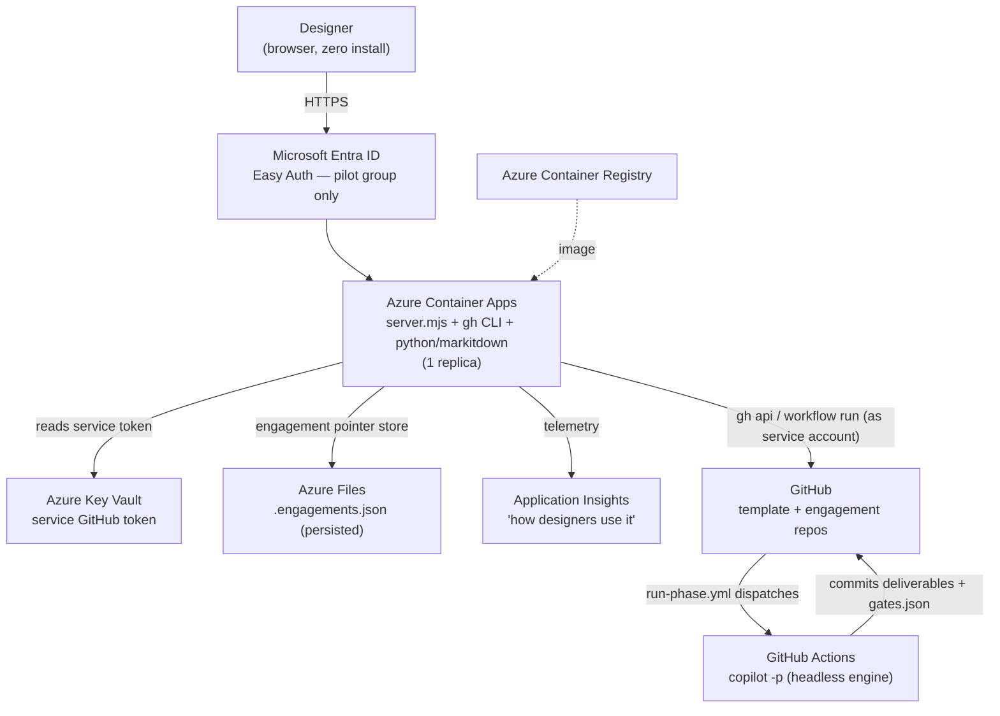

# VIBE Web Surface — Deployment Plan (Pilot)

This is the plan for getting the web surface **off a single laptop and in front of real
designers**, so we can watch how they use the harness. It is written to be handed to a
stakeholder as the basis for a go/no-go.

> **Status:** proposal. Nothing here is built yet. The current surface runs only on a
> facilitator's machine via `node surface/server.mjs`. See [`ARCHITECTURE.md`](./ARCHITECTURE.md)
> for how the surface works today.

## The goal that shapes this plan

> *"Deploy this so we can see how designers may utilise it."*

That is an **observation pilot**, not a GA launch. The priority is **lowest friction for
designers** (ideally zero install — they click a link) and **enough telemetry to watch
real usage**. We optimise the plan for those two things, and accept some pilot-grade
limitations we'd fix before a wider rollout.

## Chosen shape: hosted single-tenant on Azure

We evaluated three deployment shapes:

| Shape | Designer experience | Identity model | Effort | Verdict |
|-------|---------------------|----------------|--------|---------|
| **A. Local launcher** | Install a toolchain, run on their laptop | True per-user (their own GitHub + Copilot seat) | Low | Too much install friction for a usability pilot |
| **B. Hosted single-tenant** *(chosen)* | **Just visit a URL — zero install** | One shared service identity/seat | Medium | **Best for watching designers use it** |
| **C. Hosted multi-tenant** | Visit a URL, runs *as them* | Per-user via a **GitHub App** | High | The real product — graduate here after the pilot proves out |

**Shape B** removes all client-side friction (no Node, no `gh`, no Python on the
designer's machine) while keeping the build small. Its cost is that every engagement runs
under **one shared service identity** — fine for a dev-phase pilot, addressed in Shape C.

All hosting is **Microsoft** (Azure + Entra), per the framework's Microsoft-only rule.

## The one fact that drives everything: today it "runs as you"

The surface is currently a **personal remote control**, not a shared web app. Three
properties make that true, and each one becomes a task when we host it:

1. **No login wall.** The HTTP server (`server.mjs`) has no authentication. Anyone who can
   reach `:4310` acts with the full power of whoever ran `gh auth login`. On a laptop that's
   the owner; on a public URL that would be everyone.
2. **It shells out to local tools.** The server calls the **GitHub CLI** (`gh auth token`,
   `gh api`, `gh workflow run`, `gh secret set`) and **`python -m markitdown`** (Office/PDF →
   Markdown at source ingest). These are ambient on a laptop and must be **baked into a
   container** to host.
3. **The engine token is mirrored from the human.** At engagement creation the server copies
   the signed-in user's `gh` token into the new repo as the `COPILOT_GITHUB_TOKEN` secret
   (`setRepoSecret`), which GitHub Actions then uses to run `copilot -p` headlessly. Hosting
   means that token must come from a **service identity with a Copilot seat**, not a person.

> Note what *doesn't* move: the **engine never runs on our server**. `copilot -p` runs in
> **GitHub Actions** inside each engagement repo. Our host only needs to *dispatch* and
> *read results* — so it stays small. State is one local pointer file
> (`surface/.engagements.json`); everything real lives in GitHub.

## Target architecture

## The five gaps to close

| # | Gap today | Fix for hosting | Type |
|---|-----------|-----------------|------|
| 1 | **No login** — anyone reaching the port has full power | **Entra Easy Auth** in front of Container Apps, restricted to a named pilot group | Config |
| 2 | Needs ambient `gh` + `python`/`markitdown` | **Dockerfile** baking Node 20 + GitHub CLI + `markitdown[docx,pptx,xlsx,pdf]` | New code |
| 3 | `gh auth token` assumes an interactive human login | Set **`GH_TOKEN`** in the container from a **service-account token** in Key Vault (`gh` honours `GH_TOKEN` non-interactively for all four call sites) | Config + spike |
| 4 | State is a local file at a fixed path (lost on restart) | Make the store path env-overridable (`STORE`), point it at an **Azure Files** mount | 1-line code + config |
| 5 | Single shared identity, file store, cached token | Pin to **1 replica**; document the shared-identity caveat | Config |

The server is already mostly env-driven (`PORT`, `TEMPLATE_OWNER`, `TEMPLATE_REPO`,
`MARKITDOWN_PYTHON`), so most of this is configuration. The only code changes are the
Dockerfile (gap 2) and a one-line `STORE` env override (gap 4).

## Azure resources (the shopping list)

| Resource | Role |
|----------|------|
| **Azure Container Apps** | Hosts the container; HTTPS ingress; built-in Entra auth; scale pinned to 1 replica |
| **Azure Container Registry (ACR)** | Stores the built image |
| **Microsoft Entra ID** (app registration) | The login wall; restrict sign-in to the pilot user group |
| **Azure Key Vault** | Holds the service GitHub token (surfaced to the container as a secret env var) |
| **Azure Storage — Azure Files** | Persists `.engagements.json` across restarts/redeploys |
| **Application Insights / Log Analytics** | Captures usage — runs dispatched, errors, page hits — so we can *watch* the pilot |

**GitHub side:** a **service account** (a dedicated GitHub user, or a GitHub App later) with
a **Copilot Business seat** and permission to create repos from the template and dispatch
workflows.

## The phased plan

### Phase 0 — De-risk (do this first; it is the gate)

Two assumptions could sink Shape B. Validate both before building anything:

1. **Can a service-account token drive `copilot -p` headlessly?** This is the sharpest edge —
   a plain personal access token may not carry a Copilot seat the way a user OAuth token does.
   **Test:** put the service account's token into a throwaway demo repo as
   `COPILOT_GITHUB_TOKEN`, run `run-phase.yml`, confirm a deliverable commits back.
2. **Does `gh` work non-interactively in a container** via `GH_TOKEN` for all four call sites
   (`auth token`, `api`, `workflow run`, `secret set`)? **Test:** a local container with only
   `GH_TOKEN` set, no `gh auth login`.

**Exit criteria:** both pass → proceed. If #1 fails → the pilot jumps toward the GitHub-App
identity model (Shape C) sooner, because a shared *personal* token won't carry Copilot.

### Phase 1 — Containerize and prove locally

- Write the **Dockerfile** (Node 20 + GitHub CLI + `pip install markitdown[...]`).
- Add the **`STORE` env override** so the pointer file can live on a mounted volume.
- Configure via env: `GH_TOKEN`, `TEMPLATE_OWNER/REPO`, `MARKITDOWN_PYTHON`, `STORE`, `PORT`.
- **Acceptance:** in a local container, run the full flow end-to-end against a demo repo —
  provision → add a source → synthesize context → generate a deliverable → see it on the board.

### Phase 2 — Stand up Azure, locked down

- Push the image to **ACR**; deploy to **Container Apps** (1 replica, HTTPS ingress).
- Wire **Key Vault** (the service token) and an **Azure Files** mount (the store).
- Turn on **Entra Easy Auth**, restricted to the **named pilot users only** (no anonymous).
- **Acceptance:** a pilot designer opens the private HTTPS URL, signs in with their Microsoft
  account, and drives an engagement. A non-pilot user is denied.

### Phase 3 — Observability and a runbook

- Wire **Application Insights** to capture runs, errors, and basic usage signal (the explicit
  pilot goal: *watch how designers use it*).
- Write a one-page **ops runbook**: rotate the service token, reset/inspect the store,
  redeploy a new image, read the usage dashboard.
- **Acceptance:** we can answer "what did designers do this week?" from the dashboard.

### Phase 4 — Pilot and learn

- Onboard **2–4 designers**, give them a scenario, observe and collect feedback.
- Define the **graduation trigger to Shape C** (GitHub App, per-user identity) — e.g. when
  per-designer attribution matters, seat/cost needs to scale, or repo access must be scoped
  per person.

## Security hardening checklist (pilot-grade)

- [ ] Entra auth wall, restricted to a pilot group — **no anonymous access**.
- [ ] Service token in **Key Vault**, least-privilege (fine-grained, scoped to the template
      org + `workflow` + Copilot), surfaced as a secret env var — never in the image.
- [ ] Engagement repos stay **private** (already the default in `createEngagement`).
- [ ] No tokens in logs — the code already pipes the secret to `gh` via STDIN, not argv.
- [ ] HTTPS-only ingress; consider tenant/IP restrictions on the Container App.
- [ ] **Documented caveat:** every engagement runs as the shared service account — there is
      **no per-designer attribution** in the pilot.

## Cost (rough, pilot scale)

- Azure: Container Apps (scale-to-one) + small Storage + Key Vault + App Insights ≈
  **tens of dollars per month**.
- GitHub: **one Copilot Business seat** (~$19/month) for the service account.

## Honest caveats to raise

- **Shared identity.** Acceptable for a dev-phase pilot; the fix is Shape C (GitHub App).
- **Phase 0 is a real gate.** The Copilot-token question decides whether B ships as-is.
- **Single replica only.** The file-based pointer store rules out horizontal scale until the
  store moves to a database (also part of the Shape C graduation).

## Graduating to Shape C (the real product)

When the pilot proves the value, the multi-tenant version replaces the two pilot
compromises:

1. **Per-user identity** — a **GitHub App** (with per-user OAuth) replaces the mirrored
   shared token, so each designer's actions run as themselves with their own Copilot seat.
2. **Shared, multi-instance state** — the `.engagements.json` file becomes a managed store
   (e.g. Azure Table/Cosmos or Blob), unlocking more than one replica.

Everything else in this plan — the container, Entra auth, Key Vault, Azure Files,
App Insights — carries forward unchanged.
