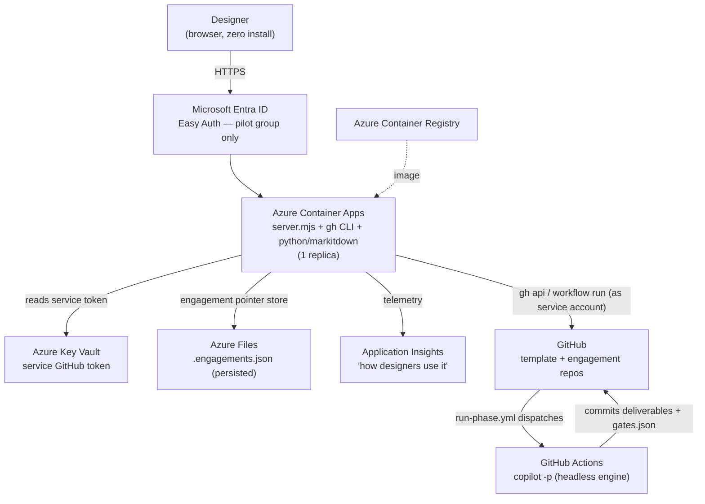

# VIBE Web Surface — Deployment Plan (Pilot)

This is the plan for getting the web surface **off a single laptop and in front of real
designers**, so we can watch how they use the harness. It is written to be handed to a
stakeholder as the basis for a go/no-go.

> **Status:** proposal. Nothing here is built yet. The current surface runs only on a
> facilitator's machine via `node surface/server.mjs`. See [`ARCHITECTURE.md`](./ARCHITECTURE.md)
> for how the surface works today.

## The goal that shapes this plan

> *"Deploy this so we can see how designers may utilise it."*

That is an **observation pilot**, not a GA launch. The priority is **lowest friction for
designers** (ideally zero install — they click a link) and **enough telemetry to watch
real usage**. We optimise the plan for those two things, and accept some pilot-grade
limitations we'd fix before a wider rollout.

## Chosen shape: hosted single-tenant on Azure

We evaluated three deployment shapes:

| Shape | Designer experience | Identity model | Effort | Verdict |
|-------|---------------------|----------------|--------|---------|
| **A. Local launcher** | Install a toolchain, run on their laptop | True per-user (their own GitHub + Copilot seat) | Low | Too much install friction for a usability pilot |
| **B. Hosted single-tenant** *(chosen)* | **Just visit a URL — zero install** | One shared service identity/seat | Medium | **Best for watching designers use it** |
| **C. Hosted multi-tenant** | Visit a URL, runs *as them* | Per-user via a **GitHub App** | High | The real product — graduate here after the pilot proves out |

**Shape B** removes all client-side friction (no Node, no `gh`, no Python on the
designer's machine) while keeping the build small. Its cost is that every engagement runs
under **one shared service identity** — fine for a dev-phase pilot, addressed in Shape C.

All hosting is **Microsoft** (Azure + Entra), per the framework's Microsoft-only rule.

## The one fact that drives everything: today it "runs as you"

The surface is currently a **personal remote control**, not a shared web app. Three
properties make that true, and each one becomes a task when we host it:

1. **No login wall.** The HTTP server (`server.mjs`) has no authentication. Anyone who can
   reach `:4310` acts with the full power of whoever ran `gh auth login`. On a laptop that's
   the owner; on a public URL that would be everyone.
2. **It shells out to local tools.** The server calls the **GitHub CLI** (`gh auth token`,
   `gh api`, `gh workflow run`, `gh secret set`) and **`python -m markitdown`** (Office/PDF →
   Markdown at source ingest). These are ambient on a laptop and must be **baked into a
   container** to host.
3. **The engine token is mirrored from the human.** At engagement creation the server copies
   the signed-in user's `gh` token into the new repo as the `COPILOT_GITHUB_TOKEN` secret
   (`setRepoSecret`), which GitHub Actions then uses to run `copilot -p` headlessly. Hosting
   means that token must come from a **service identity with a Copilot seat**, not a person.

> Note what *doesn't* move: the **engine never runs on our server**. `copilot -p` runs in
> **GitHub Actions** inside each engagement repo. Our host only needs to *dispatch* and
> *read results* — so it stays small. State is one local pointer file
> (`surface/.engagements.json`); everything real lives in GitHub.

## Per-user GitHub sign-in (multi-user mode)

The "runs as you" model above is the **legacy single-user mode**: one shared service identity,
no sign-in wall, so anyone with the URL acts as the owner. That is fine for a solo pilot but is
the wrong shape the moment a second designer needs it — their engagements would land in the
owner's account and the owner's free-text "owner" field could ask GitHub to create a repo in an
account it has no rights to (the original colleague-facing error).

The surface therefore supports an opt-in **multi-user mode** where every designer signs in with
their **own GitHub identity** via OAuth. It is **dual-mode with zero regression**:

| | Legacy mode | Multi-user mode |
|---|---|---|
| **Trigger** | `OAUTH_CLIENT_ID` / `OAUTH_CLIENT_SECRET` **unset** | both **set** |
| **Sign-in** | none (runs as the service identity) | full-page GitHub sign-in gate |
| **Engagement owner** | honors the free-text `owner` field | **forced** to the signed-in user (free-text ignored) |
| **Engine token** | service token mirrored into the repo | the signed-in user's token (their Copilot seat) |
| **Visibility** | all engagements | each designer sees **only their own** |

The shared private **pointer store** (`SURFACE_STORE_REPO`, e.g. `ablack34/vibe-surface-state`)
is always accessed with the **service token**; everything else (repo creation, dispatch, status,
sign-off, sources) runs as the **acting (signed-in) user**. Records are tagged `createdBy`, and
cross-user ids resolve to 404 — no data leak.

> **Each designer needs their own Copilot seat.** Per-user identity means the engine runs on the
> signed-in user's token, which must carry a Copilot CLI seat.

### Configure it

1. **Register a GitHub OAuth App** (Settings → Developer settings → OAuth Apps → New):
   - **Homepage URL:** `https://<fqdn>`
   - **Authorization callback URL:** `https://<fqdn>/auth/callback` (must match exactly)
   - After creating, **Generate a new client secret**. Collect the **Client ID** + **secret**.
   - The app requests the `repo workflow` scopes at sign-in.
2. **Set the config** (Bicep params or pipeline vars/secrets):
   - `oauthClientId` ← repo var `SURFACE_OAUTH_CLIENT_ID`
   - `oauthClientSecret` ← repo secret `SURFACE_OAUTH_CLIENT_SECRET` (stored in Key Vault as
     `github-oauth-client-secret`, surfaced to the container as a secretRef)
   - `baseUrl` ← repo var `SURFACE_BASE_URL` = `https://<fqdn>` (pins the OAuth `redirect_uri`)
   - `allowedLogins` ← repo var `SURFACE_ALLOWED_LOGINS` = comma-separated allow-list (optional;
     empty = any GitHub user who can sign in)

Unset the client id/secret to fall back to legacy mode with byte-for-byte the old behavior.

## Target architecture

## The five gaps to close

| # | Gap today | Fix for hosting | Type |
|---|-----------|-----------------|------|
| 1 | **No login** — anyone reaching the port has full power | **Entra Easy Auth** in front of Container Apps, restricted to a named pilot group | Config |
| 2 | Needs ambient `gh` + `python`/`markitdown` | **Dockerfile** baking Node 20 + GitHub CLI + `markitdown[docx,pptx,xlsx,pdf]` | New code |
| 3 | `gh auth token` assumes an interactive human login | Set **`GH_TOKEN`** in the container from a **service-account token** in Key Vault (`gh` honours `GH_TOKEN` non-interactively for all four call sites) | Config + spike |
| 4 | State is a local file at a fixed path (lost on restart) | Make the store path env-overridable (`STORE`), point it at an **Azure Files** mount | 1-line code + config |
| 5 | Single shared identity, file store, cached token | Pin to **1 replica**; document the shared-identity caveat | Config |

The server is already mostly env-driven (`PORT`, `TEMPLATE_OWNER`, `TEMPLATE_REPO`,
`MARKITDOWN_PYTHON`), so most of this is configuration. The only code changes are the
Dockerfile (gap 2) and a one-line `STORE` env override (gap 4).

## Azure resources (the shopping list)

| Resource | Role |
|----------|------|
| **Azure Container Apps** | Hosts the container; HTTPS ingress; built-in Entra auth; scale pinned to 1 replica |
| **Azure Container Registry (ACR)** | Stores the built image |
| **Microsoft Entra ID** (app registration) | The login wall; restrict sign-in to the pilot user group |
| **Azure Key Vault** | Holds the service GitHub token (surfaced to the container as a secret env var) |
| **Azure Storage — Azure Files** | Persists `.engagements.json` across restarts/redeploys |
| **Application Insights / Log Analytics** | Captures usage — runs dispatched, errors, page hits — so we can *watch* the pilot |

**GitHub side:** a **service account** (a dedicated GitHub user, or a GitHub App later) with
a **Copilot Business seat** and permission to create repos from the template and dispatch
workflows.

## The phased plan

### Phase 0 — De-risk (do this first; it is the gate)

Two assumptions could sink Shape B. Validate both before building anything:

1. **Can a service-account token drive `copilot -p` headlessly?** This is the sharpest edge —
   a plain personal access token may not carry a Copilot seat the way a user OAuth token does.
   **Test:** put the service account's token into a throwaway demo repo as
   `COPILOT_GITHUB_TOKEN`, run `run-phase.yml`, confirm a deliverable commits back.
2. **Does `gh` work non-interactively in a container** via `GH_TOKEN` for all four call sites
   (`auth token`, `api`, `workflow run`, `secret set`)? **Test:** a local container with only
   `GH_TOKEN` set, no `gh auth login`.

**Exit criteria:** both pass → proceed. If #1 fails → the pilot jumps toward the GitHub-App
identity model (Shape C) sooner, because a shared *personal* token won't carry Copilot.

#### Phase 0 findings — both unknowns RESOLVED (2026-06-19)

**1. Token type — resolved by authoritative docs.** The official `@github/copilot` npm
README (the exact CLI `run-phase.yml` installs) states you can *"authenticate using a
**fine-grained PAT with the 'Copilot Requests' permission** enabled"* (set via `GH_TOKEN` /
`GITHUB_TOKEN`; our workflow uses the Copilot-specific `COPILOT_GITHUB_TOKEN`, already proven
in Actions run `27824098639`), and that *"an active Copilot subscription"* is required
regardless. **So the Shape B design works:** a **service account with a Copilot seat** + a
**fine-grained PAT (Copilot Requests permission)** can drive `copilot -p` headlessly — no
OAuth device flow, no per-user token needed for the pilot. *(The proven-working local token
today is a `gho_` user-OAuth token tied to a seat-holding account; the service-account PAT is
the hostable equivalent.)*

**2. Container + non-interactive `gh` — resolved empirically.** Built the image from
[`surface/Dockerfile`](./Dockerfile) (Node 20 + GitHub CLI + MarkItDown) and ran it with only
`GH_TOKEN` set (no `gh auth login` baked in). Results:
- Server booted and resolved `as user: ablack34` → `gh api user` works non-interactively.
- `GET /api/config` and `GET /api/board` both returned 200 → the server's `gh` REST path
  (`gh api`) works headlessly in-container.
- In-container tools confirmed: `gh 2.95.0`, `markitdown 0.1.6` (Python 3.11), `node 20.20`.

**Still owned by you / IT (can't be done from here):** create the **service-account GitHub
user**, assign it a **Copilot Business seat**, mint the **fine-grained PAT**, then run the one
definitive end-to-end test — set that PAT as `COPILOT_GITHUB_TOKEN` on a demo repo and dispatch
`run-phase.yml`. See *"What you need to provision"* at the foot of this doc.

### Phase 1 — Containerize and prove locally — DONE & PROVEN (2026-06-19)

- **Dockerfile** — done & hardened: [`surface/Dockerfile`](./Dockerfile) (Node 20 + GitHub CLI +
  `markitdown[docx,pptx,xlsx,pdf]`), now runs as the **non-root `node` user** with a persistent
  **`/data`** volume for the store. *(Still optional before production: a slimmer multi-stage /
  trimmed image — it's large because MarkItDown pulls `onnxruntime`.)*
- **`STORE` env override** — done: `server.mjs` now reads `process.env.STORE` (falling back to the
  in-repo path), and `writeStore` ensures the directory exists. The pointer store can live on a
  mounted volume.
- **Configure via env** — `GH_TOKEN`, `TEMPLATE_OWNER/REPO`, `MARKITDOWN_PYTHON`, `STORE`, `PORT`.
- **Proven in-container (named volume + `GH_TOKEN` only):**
  - Board read the store from the `STORE` path and pulled **live gates from GitHub** for a real repo.
  - `POST /api/model` wrote the store to `/data` as the non-root user; the value **survived a
    `docker restart`** → volume persistence works (gap #4 closed).
  - `python -m markitdown returns.xlsx` (the server's exact call) produced a clean Markdown table →
    Office/PDF ingest works in the image.
- **Acceptance (deferred to Phase 2 on Azure):** a live `provision → generate` creates a real repo
  and dispatches a real Actions run, so it's run once the container is actually on Azure rather than
  spawning throwaway repos now. Every container-specific risk (toolchain, non-root, env config,
  store persistence) is already proven.

### Phase 2 — Stand up Azure, locked down — BUILT (IaC + pipeline) (2026-06-19)

Codified as infrastructure-as-code + CI/CD under [`surface/infra/`](./infra/) and
[`.github/workflows/deploy-surface.yml`](../.github/workflows/deploy-surface.yml). See
[`surface/infra/README.md`](./infra/README.md) for the operator guide.

- **Bicep** (`surface/infra/main.bicep`, subscription scope, matches `scaffold/infra` conventions)
  provisions the whole topology: **Container Apps** env + app (1 replica, HTTPS ingress, port 4310),
  **ACR** (image, pulled via managed identity — no admin user), **Key Vault** (service token, read via
  managed identity), **Storage + Azure Files** (`/data` store mount — optional; auto-skipped where org
  policy disables storage shared keys, see the live note below), **Log Analytics + App Insights**,
  a **user-assigned managed identity** (AcrPull + Key Vault Secrets User), and an **optional Entra Easy
  Auth wall** (conditional on an app-registration client ID).
- **Pipeline** (`deploy-surface.yml`) on push to `main` touching `surface/**`: **OIDC** login (federated
  credentials, no stored passwords) → `az deployment sub create` → **`az acr build`** (image built inside
  Azure, no Docker on the runner) → `az containerapp update`. Guarded by `vars.SURFACE_DEPLOY_CONFIGURED`
  and stripped from provisioned engagement repos (`tidy-repo.mjs`).
- **One-time bootstrap** (`surface/infra/bootstrap.ps1`) creates the OIDC identity, grants it deploy
  rights, and wires the GitHub variables/secrets; Part B registers the Entra sign-in wall once the URL
  exists.
- **PROVEN live & serving (2026-06-19):** `az deployment sub create` stood the full topology up in
  `rg-vibe-surface` (`provisioningState: Succeeded`) — role assignments, the Key Vault secret write, and
  the managed-identity wiring all succeeded against real ARM. `az acr build` built the real surface image
  in ACR and `az containerapp update` rolled it out. The live surface now answers over HTTPS:
  `GET /api/config` → `200 {"template":"ablack34/vibe-prototyping-framework","defaultOwner":"ablack34"}`
  and the SPA root (`200`, *"VIBE — New Engagement"*) — proving the whole secret chain end-to-end
  (**managed identity → Key Vault → `GH_TOKEN` → `gh api user` resolved `ablack34`**). Deployed with a
  designer's own `gh` token as the service token (run-as-you), exactly as the pipeline will with the
  service-account `COPILOT_SERVICE_TOKEN`.
- **Live finding — storage shared-key policy.** On this MCAPS subscription a corporate Azure Policy
  force-disables `allowSharedKeyAccess` on every storage account (re-disabling it within seconds of an
  override). Container Apps Azure Files mounts can authenticate **only** with the account key, so the
  durable mount failed (`mount error(13): Permission denied`, revision stuck *Activating*). Fix: the mount
  is now an **optional** Bicep param (`enablePersistentStore`, pipeline var `SURFACE_PERSISTENT_STORE`);
  deployed with it **off** so `/data` is ephemeral and the app starts cleanly. The store is just
  engagement *pointers* (every engagement is a real GitHub repo; the board re-reads live gate state per
  repo), so ephemeral is acceptable for the pilot. Durable options: a storage-account policy exemption, or
  a future git-backed store. Documented in [`infra/README.md`](./infra/README.md#durable-store--org-policy-shared-key-access).
- **Durable store — SHIPPED (git-backed).** Ephemeral `/data` meant a redeploy/restart wiped the board's
  engagement-pointer list. Fixed without any storage mount: when the env var **`STORE_REPO`** (`owner/repo`)
  is set, `readStore`/`writeStore` in `server.mjs` read/write the pointer JSON (`STORE_PATH`, default
  `engagements.json`) in a small **private GitHub repo** via the Contents API (read-modify-write on the blob
  sha, 409/422 retry), using the same service token the surface already holds. Pinned to one replica + the
  read-before-write pattern in every handler keeps the sha fresh. Wired through Bicep (`storeRepo`/`storePath`
  params → container env) and the pipeline (`vars.SURFACE_STORE_REPO`), so it survives every future deploy.
  Unset = the original local-file store (dev). State repo for this pilot: `ablack34/vibe-surface-state`.
- **Still to lock down for the pilot:** turn on the Entra Easy Auth wall (Part B), restricted to the named
  pilot users; and swap the run-as-you token for the dedicated **service-account** token + Copilot seat.

### Phase 3 — Observability and a runbook

- Wire **Application Insights** to capture runs, errors, and basic usage signal (the explicit
  pilot goal: *watch how designers use it*).
- Write a one-page **ops runbook**: rotate the service token, reset/inspect the store,
  redeploy a new image, read the usage dashboard.
- **Acceptance:** we can answer "what did designers do this week?" from the dashboard.

### Phase 4 — Pilot and learn

- Onboard **2–4 designers**, give them a scenario, observe and collect feedback.
- Define the **graduation trigger to Shape C** (GitHub App, per-user identity) — e.g. when
  per-designer attribution matters, seat/cost needs to scale, or repo access must be scoped
  per person.

## Security hardening checklist (pilot-grade)

- [ ] Entra auth wall, restricted to a pilot group — **no anonymous access**.
- [ ] Service token in **Key Vault**, least-privilege (fine-grained, scoped to the template
      org + `workflow` + Copilot), surfaced as a secret env var — never in the image.
- [ ] Engagement repos stay **private** (already the default in `createEngagement`).
- [ ] No tokens in logs — the code already pipes the secret to `gh` via STDIN, not argv.
- [ ] HTTPS-only ingress; consider tenant/IP restrictions on the Container App.
- [ ] **Documented caveat:** every engagement runs as the shared service account — there is
      **no per-designer attribution** in the pilot.

## Cost (rough, pilot scale)

- Azure: Container Apps (scale-to-one) + small Storage + Key Vault + App Insights ≈
  **tens of dollars per month**.
- GitHub: **one Copilot Business seat** (~$19/month) for the service account.

## Honest caveats to raise

- **Shared identity.** Acceptable for a dev-phase pilot; the fix is Shape C (GitHub App).
- **Phase 0 is a real gate.** The Copilot-token question decides whether B ships as-is.
- **Single replica only.** The file-based pointer store rules out horizontal scale until the
  store moves to a database (also part of the Shape C graduation).

## Graduating to Shape C (the real product)

When the pilot proves the value, the multi-tenant version replaces the two pilot
compromises:

1. **Per-user identity** — a **GitHub App** (with per-user OAuth) replaces the mirrored
   shared token, so each designer's actions run as themselves with their own Copilot seat.
2. **Shared, multi-instance state** — the `.engagements.json` file becomes a managed store
   (e.g. Azure Table/Cosmos or Blob), unlocking more than one replica.

Everything else in this plan — the container, Entra auth, Key Vault, Azure Files,
App Insights — carries forward unchanged.

## What you need to provision (the gate's remaining human step)

Phase 0 proved the *mechanism*. To finish the gate, someone with the right GitHub org / IT
rights must create the shared service identity — this can't be automated from the surface:

1. **Create a service-account GitHub user** (e.g. `vibe-engine-svc`) and give it access to the
   template repo and wherever engagement repos should live.
2. **Assign it a Copilot Business seat** (Org → Settings → Copilot → Access). *Without a seat,
   no token will drive `copilot -p`, regardless of type.*
3. **Mint a fine-grained PAT** on that account at
   <https://github.com/settings/personal-access-tokens/new> with:
   - **Copilot Requests** — to run the engine (`copilot -p`);
   - **Administration: read/write** — create repos from the template + manage Actions secrets;
   - **Contents: read/write** — the Actions run commits deliverables back;
   - **Actions: read/write** + **Workflows: read/write** — dispatch and update `run-phase.yml`;
   - **Metadata: read** (implied).

   *(One token does double duty in the pilot: the surface's control-plane `gh` calls **and** the
   mirrored engine `COPILOT_GITHUB_TOKEN`. These can be split into two narrower tokens later.)*
4. **Run the one definitive test:** set that PAT as the `COPILOT_GITHUB_TOKEN` secret on a demo
   engagement repo and dispatch `run-phase.yml` (e.g. `vibe-personas`). A green run that commits
   a deliverable back closes Phase 0 end-to-end. *(Today's runs use a designer's own token; this
   swaps in the service account's.)*

Once that token exists, it goes into **Azure Key Vault** and the rest of the plan (Phases 1–4)
proceeds.

